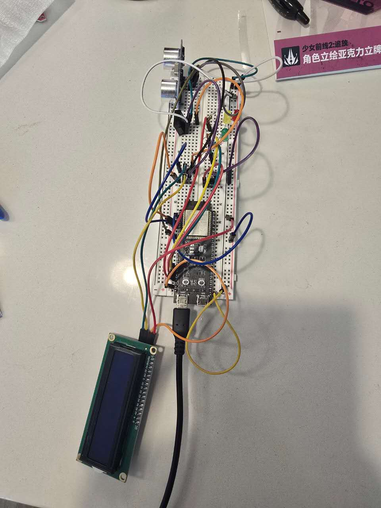
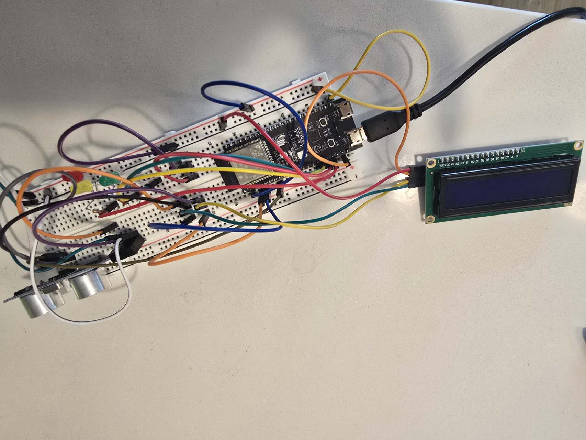
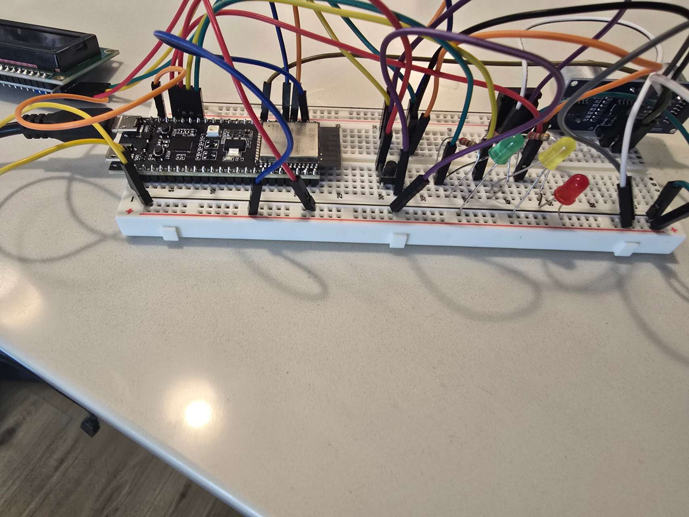
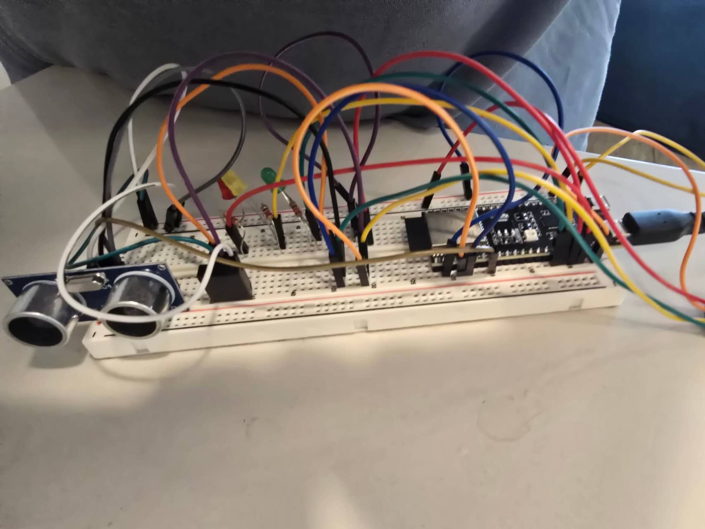

# ESP32-S3 Real-Time Environmental Alarm System

This project is a real-time monitoring and alarm system built with an ESP32-S3.

It reads temperature, humidity, and object distance, shows the current values on a 16x2 LCD, and uses three LEDs to indicate the system status. A push button switches between five monitoring modes.

## Hardware Setup

The prototype was assembled on breadboards and tested with the sensors, LCD, button, and status LEDs connected to the ESP32-S3.

<p align="center">
  
  
</p>

<p align="center">
  
  
</p>

## Features

- Temperature and humidity measurement using an AM2320
- Distance measurement using an HC-SR04
- Five selectable monitoring modes
- Green, yellow, and red status LEDs
- 16x2 LCD output
- Push-button mode selection
- FreeRTOS tasks running across both ESP32-S3 cores
- Queue-based communication between tasks
- Detection of invalid sensor readings and missing ultrasonic echoes

## Monitoring Modes

The button cycles through five modes:

1. Distance
2. Temperature
3. Humidity
4. Temperature and humidity
5. Full monitoring

The selected mode determines which sensor values are used when calculating the current status.

## Status Levels

| Status | LED | Meaning |
|---|---|---|
| Normal | Green | The selected sensor values are inside the normal range |
| Warning | Yellow | One or more values are close to the configured limit |
| Alert | Red | A value is outside the allowed range or a required reading is invalid |

## Hardware

- ESP32-S3 development board
- AM2320 temperature and humidity sensor
- HC-SR04 ultrasonic distance sensor
- 16x2 I2C LCD
- Push button
- Green, yellow, and red LEDs
- Current-limiting resistors
- Breadboards and jumper wires

## Pin Configuration

| Component | Signal | ESP32-S3 Pin |
|---|---|---|
| LCD and AM2320 | SDA | GPIO 4 |
| LCD and AM2320 | SCL | GPIO 5 |
| HC-SR04 | Trigger | GPIO 16 |
| HC-SR04 | Echo | GPIO 15 |
| Green LED | Output | GPIO 10 |
| Yellow LED | Output | GPIO 11 |
| Red LED | Output | GPIO 13 |
| Push Button | Input | GPIO 12 |

The LCD uses I2C address `0x27`.

The LCD and AM2320 share the same I2C bus on GPIO 4 and GPIO 5.

## Software Structure

The firmware is written in C++ using the Arduino ESP32 framework and FreeRTOS.

The program is divided into five tasks:

### `AM2320Task`

Reads temperature and humidity once per second.

The readings are checked with `isnan()` before they are sent to the rest of the system.

### `UltrasonicTask`

Measures distance with the HC-SR04 every 250 milliseconds.

Five readings are collected and the valid samples are averaged. Missing echoes and values outside the expected sensor range are rejected.

### `ControlTask`

Receives sensor messages from the sensor queue and stores the latest valid readings.

It checks the selected monitoring mode, calculates the current status, and controls the three LEDs.

### `LCDTask`

Receives the latest display information and updates the LCD.

The LCD shows the selected mode, current status, and the sensor values used by that mode.

### `ButtonTask`

Reads the push button and moves to the next monitoring mode.

A debounce period is used so one button press does not switch through several modes.

## Core Assignment

The sensor-reading tasks run on Core 0:

- `AM2320Task`
- `UltrasonicTask`

The control and interface tasks run on Core 1:

- `ControlTask`
- `LCDTask`
- `ButtonTask`

This separates sensor reading from the display and control work.

## Task Communication

Two FreeRTOS queues are used.

### `sensorQueue`

Carries readings from the AM2320 and HC-SR04 tasks to the control task.

Each message includes:

- Sensor type
- Temperature
- Humidity
- Distance
- Validity status

### `displayQueue`

Carries the latest system state from the control task to the LCD task.

The queue holds one item and uses `xQueueOverwrite()`, so the LCD receives the most recent update instead of waiting through old display messages.

## Alarm Thresholds

### Distance

| Distance | Status |
|---|---|
| Greater than 30 cm | Normal |
| Greater than 15 cm and up to 30 cm | Warning |
| 15 cm or less | Alert |

### Temperature

| Temperature | Status |
|---|---|
| 18°C to 28°C | Normal |
| 15°C to 18°C or 28°C to 32°C | Warning |
| Outside those ranges | Alert |

### Humidity

| Humidity | Status |
|---|---|
| 30% to 60% | Normal |
| 20% to 30% or 60% to 70% | Warning |
| Outside those ranges | Alert |

If a required sensor reading is invalid, the system reports an alert for that mode.

## Required Libraries

Install these libraries through the Arduino Library Manager:

- `LiquidCrystal_I2C`
- `Adafruit AM2320`
- `Adafruit Unified Sensor`

FreeRTOS support is included with the ESP32 Arduino board package.

## Running the Project

1. Install Arduino IDE.
2. Install the ESP32 board package.
3. Select `ESP32-S3 Dev Module`.
4. Install the required libraries.
5. Open `environmental_alarm.ino`.
6. Select the correct serial port.
7. Compile and upload the firmware.
8. Open Serial Monitor at `115200` baud.

Example output:

```text
=== ESP32-S3 Environmental Alarm ===
AM2320 begin OK
[AM2320Task] T=27.60 C H=34.00 %
[UltrasonicTask] D=17.75 cm
[ButtonTask] Mode changed to FULL
```

## Repository Structure

```text
ESP32-S3-Real-Time-Environmental-Alarm-System/
├── README.md
├── environmental_alarm.ino
└── images/
    ├── RTE1.jpg
    ├── RTE2.jpg
    ├── RTE3.jpg
    └── RTE4.jpg
```

## Problems I Ran Into

### AM2320 read errors

The AM2320 occasionally returned invalid temperature or humidity values.

The program checks both values before updating the system. Invalid readings are marked as errors instead of being used as real measurements.

### HC-SR04 no-echo readings

The ultrasonic sensor sometimes returned no echo because of object position, wiring, or pulse timing.

A timeout is used, and measurements outside the valid 2 cm to 400 cm range are rejected.

### Unstable distance values

A single ultrasonic measurement could change noticeably between samples.

The program takes five measurements and averages the valid results before sending the distance to the control task.

### Button bouncing

One physical button press could produce several rapid input transitions.

A 50-millisecond debounce period was added so each press changes the mode only once.

## Possible Improvements

- Use a mutex or event group for the shared monitoring mode
- Allow alarm thresholds to be changed by the user
- Save settings in nonvolatile memory
- Add a buzzer
- Add Wi-Fi monitoring
- Record sensor values over time
- Build a simple web dashboard
- Replace the breadboard circuit with a custom PCB
- Add an enclosure

## Author

Rui Kong  
Electrical and Computer Engineering  
University of Washington
